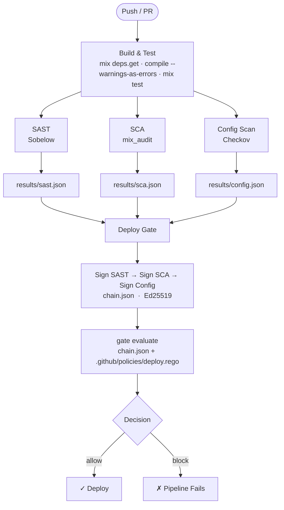
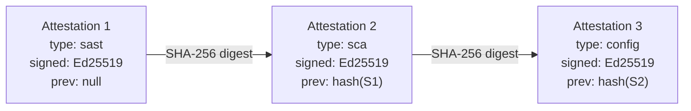

# Phoenix DevSecOps Demo

[](../../actions/workflows/devsecops-pipeline.yml)

A demo [Phoenix](https://www.phoenixframework.org/) application wired into the
[devsecops-attestation](https://github.com/MemerGamer/devsecops-attestation)
cryptographic pipeline.

Every push runs three security checks, signs each result into an Ed25519-linked
attestation chain, then evaluates a deploy gate via OPA/Rego policy. Deployment
only proceeds if every signature verifies and the policy allows it.

---

## Pipeline overview



## Attestation chain



Any insertion, deletion, or reordering of attestations breaks the chain and
causes `gate evaluate` to reject the deployment.

---

## Security tools

| Stage | Tool | What it checks |
|---|---|---|
| SAST | [Sobelow](https://github.com/nccgroup/sobelow) | Phoenix-specific vulnerabilities (XSS, SQLi, CSRF…) |
| SCA | [mix_audit](https://github.com/mirego/mix_audit) | Known CVEs in Hex dependencies |
| Config | [Checkov](https://www.checkov.io/) | Misconfigurations in Dockerfile and IaC files |

---

## Project structure

```
Phoenix-DevSecOps-Demo/
├── .github/
│   ├── policies/
│   │   └── deploy.rego              # OPA/Rego deployment policy
│   └── workflows/
│       └── devsecops-pipeline.yml   # GitHub Actions CI/CD workflow
├── assets/                          # JS / CSS (esbuild + Tailwind)
├── config/                          # Phoenix config (dev, test, runtime)
├── lib/
│   ├── demo/                        # Application, Repo, Mailer
│   └── demo_web/                    # Router, Endpoint, Controllers, Components
├── priv/repo/migrations/
├── results/
│   └── .gitkeep                     # CI writes scan JSONs here
├── test/
├── Dockerfile
└── mix.exs
```

---

## Setup

### 1. Prerequisites

- Elixir ≥ 1.15 / Erlang OTP ≥ 26
- PostgreSQL 14+ running locally (user `postgres`, password `postgres`)
  ```bash
  # Arch / CachyOS
  sudo systemctl start postgresql

  # Docker alternative
  docker run -d --name demo-postgres -p 5432:5432 \
    -e POSTGRES_PASSWORD=postgres postgres:16
  ```

### 2. Install and set up the app

```bash
mix setup   # deps.get + ecto.create + ecto.migrate + assets
```

### 3. Start the server

```bash
mix phx.server
# or inside IEx:
iex -S mix phx.server
```

Visit [http://localhost:4000](http://localhost:4000).

---

## CI/CD setup (GitHub Actions)

### 1. Generate attestation keys

```bash
git clone https://github.com/MemerGamer/devsecops-attestation
cd devsecops-attestation
go run ./cmd/keygen --out keys/
```

### 2. Add secrets to this repository

**Settings → Secrets and variables → Actions → New repository secret**:

| Secret | Value |
|---|---|
| `ATTESTATION_SIGNING_KEY` | Contents of `keys/private.hex` |
| `ATTESTATION_PUBLIC_KEY` | Contents of `keys/public.hex` |

> **Never commit `private.hex`.** The `keys/` directory is gitignored in the attestation repo.

### 3. (Optional) Require manual approval before deploy

The `deploy-gate` job targets the `production` environment:

**Settings → Environments → production → Required reviewers**

### 4. Customize the deploy policy

Edit [`.github/policies/deploy.rego`](.github/policies/deploy.rego) to adjust
what counts as a blocking finding. The default policy blocks on any `critical`
severity finding and requires both SAST and SCA to report `passed: true`.

---

## Local development

```bash
# Install deps and set up DB
mix setup

# Run tests
mix test

# Run SAST locally
mix sobelow

# Run SCA locally
mix deps.audit

# Full pre-commit check (compile + format + test)
mix precommit
```

## License

MIT
