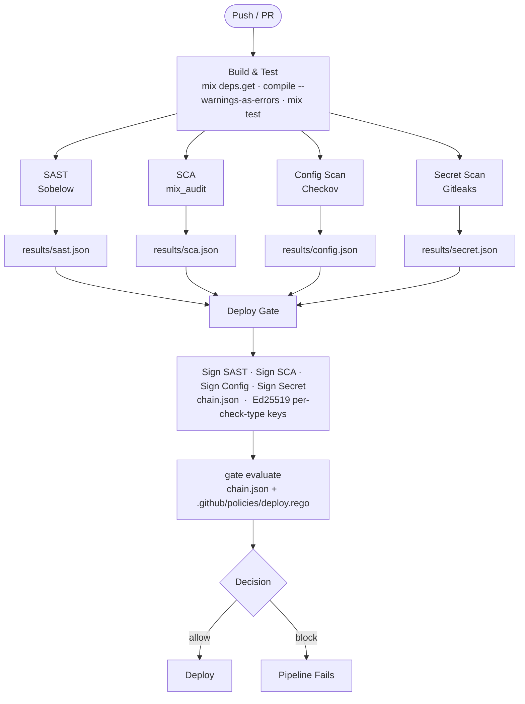
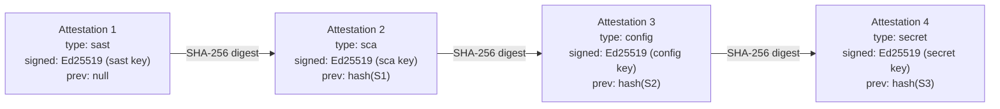

# Phoenix DevSecOps Demo

[](../../actions/workflows/devsecops-pipeline.yml)

A demo [Phoenix](https://www.phoenixframework.org/) application wired into the
[devsecops-attestation](https://github.com/MemerGamer/devsecops-attestation)
cryptographic pipeline.

Every push runs four security checks, signs each result into an Ed25519-linked
attestation chain, then evaluates a deploy gate via OPA/Rego policy. Deployment
only proceeds if every signature verifies against the authorized per-check-type
key and the policy allows it.

---

## Pipeline overview


```mermaid
flowchart TD
    A([Push / PR]) --> B["Build & Test\nmix deps.get · compile --warnings-as-errors · mix test"]
    B --> C["SAST\nSobelow"]
    B --> D["SCA\nmix_audit"]
    B --> E["Config Scan\nCheckov"]
    B --> F["Secret Scan\nGitleaks"]
    C --> G[results/sast.json]
    D --> H[results/sca.json]
    E --> I[results/config.json]
    F --> J[results/secret.json]
    G & H & I & J --> K[Deploy Gate]
    K --> L["Sign SAST · Sign SCA · Sign Config · Sign Secret\nchain.json  ·  Ed25519 per-check-type keys"]
    L --> M["gate evaluate\nchain.json + .github/policies/deploy.rego"]
    M --> N{Decision}
    N -->|allow| O[Deploy]
    N -->|block| P[Pipeline Fails]
```

## Attestation chain


```mermaid
flowchart LR
    S1["Attestation 1\ntype: sast\nsigned: Ed25519 (sast key)\nprev: null"] -->|SHA-256 digest| S2
    S2["Attestation 2\ntype: sca\nsigned: Ed25519 (sca key)\nprev: hash(S1)"] -->|SHA-256 digest| S3
    S3["Attestation 3\ntype: config\nsigned: Ed25519 (config key)\nprev: hash(S2)"] -->|SHA-256 digest| S4
    S4["Attestation 4\ntype: secret\nsigned: Ed25519 (secret key)\nprev: hash(S3)"]
```

Each check type uses a dedicated key pair. A compromised SAST key cannot forge
SCA, config, or secret attestations. Any insertion, deletion, or reordering of
attestations breaks the SHA-256 chain linkage and causes `gate evaluate` to
reject the deployment.

---

## Security tools

| Stage | Tool | What it checks |
|---|---|---|
| SAST | [Sobelow](https://github.com/nccgroup/sobelow) | Phoenix-specific vulnerabilities (XSS, SQLi, CSRF...) |
| SCA | [mix_audit](https://github.com/mirego/mix_audit) | Known CVEs in Hex dependencies |
| Config | [Checkov](https://www.checkov.io/) | Misconfigurations in Dockerfile and IaC files |
| Secret | [Gitleaks](https://github.com/gitleaks/gitleaks) | Hardcoded credentials and secrets in source code |

---

## Project structure

```
Phoenix-DevSecOps-Demo/
├── .github/
│   ├── policies/
│   │   └── deploy.rego              # OPA/Rego deployment policy
│   └── workflows/
│       └── devsecops-pipeline.yml   # GitHub Actions CI/CD workflow
├── assets/                          # JS / CSS (esbuild + Tailwind)
├── config/                          # Phoenix config (dev, test, runtime)
├── lib/
│   ├── demo/                        # Application, Repo, Mailer
│   └── demo_web/                    # Router, Endpoint, Controllers, Components
├── priv/repo/migrations/
├── results/
│   └── .gitkeep                     # CI writes scan JSONs here
├── scripts/
│   └── act-debug.sh                 # Local pipeline runner (act)
├── test/
├── Dockerfile
└── mix.exs
```

---

## Setup

### 1. Prerequisites

- Elixir >= 1.15 / Erlang OTP >= 26
- PostgreSQL 14+ running locally (user `postgres`, password `postgres`)
  ```bash
  # Arch / CachyOS
  sudo systemctl start postgresql

  # Docker alternative
  docker run -d --name demo-postgres -p 5432:5432 \
    -e POSTGRES_PASSWORD=postgres postgres:16
  ```

### 2. Install and set up the app

```bash
mix setup   # deps.get + ecto.create + ecto.migrate + assets
```

### 3. Start the server

```bash
mix phx.server
# or inside IEx:
iex -S mix phx.server
```

Visit [http://localhost:4000](http://localhost:4000).

---

## CI/CD setup (GitHub Actions)

The pipeline uses per-check-type key pairs. Each check type has its own dedicated
signing key so a compromise is contained to a single check.

### 1. Generate four key pairs

```bash
git clone https://github.com/MemerGamer/devsecops-attestation
cd devsecops-attestation
for check in sast sca config secret; do
  go run ./cmd/keygen --out "keys/$check"
done
# Each directory contains private.hex (keep secret) and public.hex
```

### 2. Add all eight secrets to this repository

**Settings -> Secrets and variables -> Actions -> New repository secret**

| Secret | Value |
|---|---|
| `SAST_SIGNING_KEY` | Contents of `keys/sast/private.hex` |
| `SCA_SIGNING_KEY` | Contents of `keys/sca/private.hex` |
| `CONFIG_SIGNING_KEY` | Contents of `keys/config/private.hex` |
| `SECRET_SCANNING_SIGNING_KEY` | Contents of `keys/secret/private.hex` |
| `SAST_PUBLIC_KEY` | Contents of `keys/sast/public.hex` |
| `SCA_PUBLIC_KEY` | Contents of `keys/sca/public.hex` |
| `CONFIG_PUBLIC_KEY` | Contents of `keys/config/public.hex` |
| `SECRET_SCANNING_PUBLIC_KEY` | Contents of `keys/secret/public.hex` |

> **Never commit any `private.hex` file.** The `keys/` directory is gitignored in the attestation repo.

### 3. Policy hash (keep in sync)

The gate step pins the SHA-256 of `deploy.rego` via `--policy-hash`. If you update
the policy, recompute the hash and update the workflow:

```bash
sha256sum .github/policies/deploy.rego
```

Then update `--policy-hash` in `.github/workflows/devsecops-pipeline.yml`.

### 4. (Optional) Require manual approval before deploy

The `deploy-gate` job targets the `production` environment:

**Settings -> Environments -> production -> Required reviewers**

---

## Local development

```bash
# Install deps and set up DB
mix setup

# Run tests
mix test

# Run SAST locally
mix sobelow

# Run SCA locally
mix deps.audit

# Full pre-commit check (compile + format + test)
mix precommit
```

### Local pipeline simulation (act)

```bash
# Runs the full pipeline locally via act (generates test keys automatically)
bash scripts/act-debug.sh

# Run a specific job
bash scripts/act-debug.sh deploy-gate
```

## License

MIT
