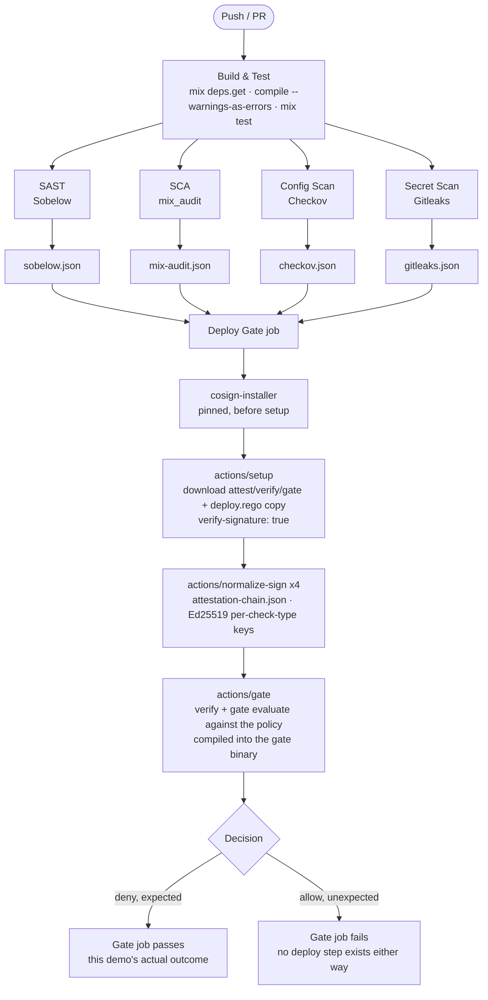
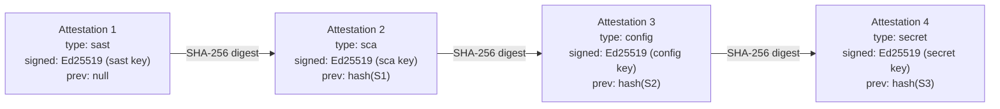

# Phoenix DevSecOps Demo

[](../../actions/workflows/devsecops-pipeline.yml)

A demo [Phoenix](https://www.phoenixframework.org/) application wired into the
[devsecops-attestation](https://github.com/MemerGamer/devsecops-attestation)
cryptographic pipeline.

Every push and pull request runs four security checks, then reuses
devsecops-attestation's
[composite actions](https://github.com/MemerGamer/devsecops-attestation/tree/main/actions)
to normalize and sign each raw result into an Ed25519-linked attestation
chain, and to run a `deploy-gate` job that evaluates the chain against
devsecops-attestation's canonical OPA/Rego policy. This repository no longer
clones or builds the attestation CLI from source, and no longer carries its
own copy of the policy: `actions/setup` downloads the released binaries and
a copy of `deploy.rego`, so there is exactly one policy to audit, upstream.
The `gate` binary evaluates against the policy compiled into it, not the
downloaded copy (see "Policy" below), so there is also exactly one place
that policy is compiled into. There is no deploy step in this pipeline:
`deploy-gate` is the gate a real deploy step would sit behind, and reaching
the expected decision -- every signature verifying against the authorized
per-check-type key, and the policy either allowing or denying as expected --
is as far as this demo goes.

---

## Pipeline overview


```mermaid
flowchart TD
    A([Push / PR]) --> B["Build & Test\nmix deps.get · compile --warnings-as-errors · mix test"]
    B --> C["SAST\nSobelow"]
    B --> D["SCA\nmix_audit"]
    B --> E["Config Scan\nCheckov"]
    B --> F["Secret Scan\nGitleaks"]
    C --> G[sobelow.json]
    D --> H[mix-audit.json]
    E --> I[checkov.json]
    F --> J[gitleaks.json]
    G & H & I & J --> K[Deploy Gate job]
    K --> K0["cosign-installer\npinned, before setup"]
    K0 --> K1["actions/setup\ndownload attest/verify/gate + deploy.rego copy\nverify-signature: true"]
    K1 --> L["actions/normalize-sign x4\nattestation-chain.json · Ed25519 per-check-type keys"]
    L --> M["actions/gate\nverify + gate evaluate against the policy\ncompiled into the gate binary"]
    M --> N{Decision}
    N -->|deny, expected| O[Gate job passes\nthis demo's actual outcome]
    N -->|allow, unexpected| P[Gate job fails\nno deploy step exists either way]
```

There is no deploy step anywhere in this pipeline. `deploy-gate` is a
stand-in for the check a real deploy step would sit behind: `deny` is this
demo's expected, intended outcome (see "Expected gate outcome" below) and
makes the gate job pass under `expect: deny`; an unexpected `allow` or any
evaluation error fails it instead.

## Attestation chain


```mermaid
flowchart LR
    S1["Attestation 1\ntype: sast\nsigned: Ed25519 (sast key)\nprev: null"] -->|SHA-256 digest| S2
    S2["Attestation 2\ntype: sca\nsigned: Ed25519 (sca key)\nprev: hash(S1)"] -->|SHA-256 digest| S3
    S3["Attestation 3\ntype: config\nsigned: Ed25519 (config key)\nprev: hash(S2)"] -->|SHA-256 digest| S4
    S4["Attestation 4\ntype: secret\nsigned: Ed25519 (secret key)\nprev: hash(S3)"]
```

Each check type uses a dedicated key pair. A compromised SAST key cannot forge
a signature that verifies as an SCA, config, or secret attestation -- that is
a cryptographic guarantee about what each key can *sign*, not a statement
about where the keys are stored or who can read them operationally; see
"Trust boundaries and recommended repository settings" below for that. Any
insertion, deletion, or reordering of attestations breaks the SHA-256 chain
linkage and causes `gate evaluate` to reject the run.

## Expected gate outcome

The `deploy-gate` job runs with `expect: deny`, and is expected to deny on
every run. This demo intentionally ships hardcoded `secret_key_base` literals
in `config/dev.exs` and `config/test.exs` (see git history: "fix: block
deployment on any hardcoded credential finding"). Gitleaks findings are
always normalized to `critical` severity, and the policy compiled into the
`gate` binary (v0.4.0 defaults: `fail_on_severity: high`, `zero_tolerance_checks:
secret`, `required_checks: sast, sca, config, secret`) treats the `secret`
check type as zero-tolerance (any finding, any severity, blocks deployment)
as well as blocking any high-or-above severity finding outright. So the
secret-scan attestation alone is enough to deny the gate, regardless of what
SAST, SCA, or config-scan find.

Re-simulating the released v0.4.0 action scripts (`normalize-sign` x4 then
`gate`) against this pipeline's raw scan artifacts against the bundled
policy's defaults currently produces a deny with these reason types:

- **failed checks** -- one or more check types (in the observed run: sast,
  sca, secret) report an attestation whose `result.passed` is `false`.
- **findings at or above the blocking severity threshold** (`high` by
  default) -- Sobelow and Gitleaks findings (Gitleaks findings always
  normalize to critical), plus any mix_audit advisory rated high or above.
- **hardcoded credential findings** -- Gitleaks findings on the
  zero-tolerance `secret` check type (the `secret_key_base` literals above).

Exact counts are not reproduced here since they shift with dependency and
scanner-database updates; the reason types above are what `expect: deny`
checks for staying stable. `expect: deny` makes this the pipeline's
intended, non-flaky outcome: the job fails only if the gate unexpectedly
*allows*, or if gate evaluation itself errors (bad signer, hash mismatch,
missing log entry, malformed chain) rather than reaching a policy decision
at all.

If the hardcoded secrets are ever removed from the demo (making it an
"allow" demo instead), flip `expect: deny` to `expect: allow` in
`.github/workflows/devsecops-pipeline.yml`.

---

## Security tools

| Stage | Tool | What it checks |
|---|---|---|
| SAST | [Sobelow](https://github.com/nccgroup/sobelow) | Phoenix-specific vulnerabilities (XSS, SQLi, CSRF...) |
| SCA | [mix_audit](https://github.com/mirego/mix_audit) | Known CVEs in Hex dependencies |
| Config | [Checkov](https://www.checkov.io/) | Misconfigurations in Dockerfile and IaC files |
| Secret | [Gitleaks](https://github.com/gitleaks/gitleaks) | Hardcoded credentials and secrets in source code |

---

## Project structure

```
Phoenix-DevSecOps-Demo/
├── .github/
│   ├── dependabot.yml                # github-actions, mix, docker updates
│   └── workflows/
│       └── devsecops-pipeline.yml   # GitHub Actions CI/CD workflow
├── assets/                          # JS / CSS (esbuild + Tailwind)
├── config/                          # Phoenix config (dev, test, runtime)
├── lib/
│   ├── demo/                        # Application, Repo, Mailer
│   └── demo_web/                    # Router, Endpoint, Controllers, Components
├── priv/repo/migrations/
├── results/
│   └── .gitkeep                     # CI writes scan JSONs here
├── scripts/
│   └── act-debug.sh                 # Local pipeline runner (act)
├── test/
├── Dockerfile
└── mix.exs
```

---

## Setup

### 1. Prerequisites

- Elixir ~> 1.19 / Erlang OTP 28 (matching `mix.exs`'s `elixir: "~> 1.19"`
  and the CI workflow's `erlef/setup-beam` versions)
- PostgreSQL 14+ running locally (user `postgres`, password `postgres`)
  ```bash
  # Arch / CachyOS
  sudo systemctl start postgresql

  # Docker alternative
  docker run -d --name demo-postgres -p 5432:5432 \
    -e POSTGRES_PASSWORD=postgres postgres:16
  ```

### 2. Install and set up the app

```bash
mix setup   # deps.get + ecto.create + ecto.migrate + assets
```

### 3. Start the server

```bash
mix phx.server
# or inside IEx:
iex -S mix phx.server
```

Visit [http://localhost:4000](http://localhost:4000).

---

## CI/CD setup (GitHub Actions)

The pipeline uses per-check-type key pairs. Each check type has its own dedicated
signing key so a compromise is contained to a single check.

### 1. Generate four key pairs

```bash
git clone https://github.com/MemerGamer/devsecops-attestation
cd devsecops-attestation
for check in sast sca config secret; do
  go run ./cmd/keygen --out "keys/$check"
done
# Each directory contains private.hex (keep secret) and public.hex
```

### 2. Add all eight secrets to this repository

**Settings -> Secrets and variables -> Actions -> New repository secret**

| Secret | Value |
|---|---|
| `SAST_SIGNING_KEY` | Contents of `keys/sast/private.hex` |
| `SCA_SIGNING_KEY` | Contents of `keys/sca/private.hex` |
| `CONFIG_SIGNING_KEY` | Contents of `keys/config/private.hex` |
| `SECRET_SCANNING_SIGNING_KEY` | Contents of `keys/secret/private.hex` |
| `SAST_PUBLIC_KEY` | Contents of `keys/sast/public.hex` |
| `SCA_PUBLIC_KEY` | Contents of `keys/sca/public.hex` |
| `CONFIG_PUBLIC_KEY` | Contents of `keys/config/public.hex` |
| `SECRET_SCANNING_PUBLIC_KEY` | Contents of `keys/secret/public.hex` |

> **Never commit any `private.hex` file.** The `keys/` directory is gitignored in the attestation repo.

### 3. Policy

The `deploy-gate` job's `actions/gate` step passes no `policy` or
`policy-hash` input. Without `--policy`, `gate evaluate` uses the canonical
`deploy.rego` policy compiled into the `gate` binary itself at build time
(`policy.DefaultPolicy`, embedded from `policies/deploy.rego` in
devsecops-attestation) -- **not** the separate copy of `deploy.rego` that
`actions/setup` also downloads and installs alongside the CLI binaries. That
downloaded copy exists for inspection, or for a caller that wants to pin it
explicitly via `--policy` / `--policy-hash`; this workflow does neither, so
it plays no role in what actually evaluates. Either way there is no local
copy of the policy to keep in sync in this repository: the policy lives and
is versioned upstream, one file compiled into one binary, for every
consumer.

### 4. (Optional) Require manual approval before deploy

The `deploy-gate` job targets the `production` environment:

**Settings -> Environments -> production -> Required reviewers**

Trade-off: `deploy-gate`'s `if:` condition (below) still lets same-repository
PR runs and pushes to any branch other than `main` (e.g. `develop`) enter a
job with `environment: production`. If a deployment branch policy and/or
required reviewers are added on `production`, those same-repo PR and
non-`main` push runs would then fail (branch policy) or sit waiting for
approval (required reviewers) instead of completing, which would make PR CI
red. To keep PR CI green while still gating real deploys, either narrow the
`if:` to `github.ref == 'refs/heads/main'` or point non-`main` runs at a
separate, non-production environment.

### 5. Dependabot and fork PRs skip deploy-gate

GitHub withholds repository secrets from workflow runs triggered by
Dependabot, so every `SAST_SIGNING_KEY`-style input on a Dependabot PR would
be empty and the job would abort. The `deploy-gate` job also targets the
`production` environment (see above); if left running, an empty
Dependabot-triggered attempt would sit waiting on required reviewers instead
of failing fast. The same is true of a PR from a fork: GitHub withholds
repository secrets from `pull_request` runs whose head repository is not
this one, for the same reason. `deploy-gate` therefore has:

```yaml
if: >-
  github.actor != 'dependabot[bot]' &&
  (github.event_name == 'push' || github.event.pull_request.head.repo.full_name == github.repository)
```

and simply does not run on Dependabot PRs or fork PRs. The four scanner jobs
(SAST, SCA, config scan, secret scan) are unaffected and still run and
report findings on every PR, including Dependabot's and forks'. To exercise
a Dependabot version bump against `deploy-gate` anyway (e.g. to confirm a
bumped dependency doesn't change the expected gate decision), configure
[Dependabot secrets](https://docs.github.com/en/code-security/dependabot/troubleshooting-dependabot/troubleshooting-dependabot-on-github-actions#accessing-secrets)
(**Settings -> Secrets and variables -> Dependabot**) with the same eight
signing/public key secrets as the repository secrets above; Dependabot-
triggered runs receive those instead of repository secrets, and the `if:`
condition above would then need `dependabot[bot]` removed for such a test.

---

## Trust boundaries and recommended repository settings

The per-check-type key design cryptographically isolates the four
attestation types from each other: a compromised SAST key cannot produce a
signature that verifies as an SCA, config, or secret attestation, because
each check type's public key is checked independently by `gate evaluate
--authorized-signers`. That claim is true, but narrow -- it says nothing
about where the *private* keys live operationally, which is a separate,
broader trust boundary:

- All four `*_SIGNING_KEY` secrets are consumed by the same `deploy-gate`
  job, in the same workflow run. A workflow run that can read one can read
  all four; the per-check-type isolation is about what a compromised key can
  *forge*, not about blast radius if the workflow itself, or its runner, is
  compromised.
- As plain **repository secrets**, all eight keys are available to any
  workflow run in this repository that can reach a job with `secrets.*`
  access -- including a run triggered from any branch, not just `main`, as
  long as that branch's workflow file requests the secret. `environment:
  production` on `deploy-gate` gates *when the job runs* (e.g. required
  reviewers), but it does not change *repository*-secret visibility the way
  environment-scoped secrets would; a same-repository branch that edits the
  workflow to print or exfiltrate `secrets.SAST_SIGNING_KEY` can do so today
  without needing production environment access, because the secret is a
  repository secret, not an environment one.
- Dependabot and fork PRs are excluded from `deploy-gate` (above), which
  closes the most obvious external route to those secrets, but does not
  change the same-repository exposure above.
- Raw scan-result artifacts travel between jobs **unsigned**. The signature
  only attests to what `deploy-gate` actually downloaded and fed to
  `normalize-sign`; nothing cryptographically ties a raw artifact back to
  the job that produced it. Artifact isolation (separate per-check-type
  download paths, no shared merge) prevents accidental overwrite between
  check types, but it is not a substitute for the attestation chain's own
  guarantees, which only start once a result has been signed.

Recommended hardening, not yet applied in this demo (left as configuration
the repository owner should make deliberately):

1. **Move the four `*_SIGNING_KEY` secrets into `production` environment
   secrets**, not repository secrets, with a deployment branch policy
   restricting the `production` environment to `main` only (**Settings ->
   Environments -> production -> Deployment branches and tags**). This
   closes the same-repository-branch exposure above: only a workflow run
   deploying from `main` could read them. Optionally add required reviewers
   on the same environment for a human gate before the keys are even used.
   Trade-off: as written, `deploy-gate` also runs for same-repository PRs
   and pushes to non-`main` branches (see "4. (Optional) Require manual
   approval before deploy" above), and those runs would then fail against a
   main-only deployment branch policy, or wait indefinitely on required
   reviewers, instead of completing. Narrow the job's `if:` to
   `github.ref == 'refs/heads/main'`, or run non-`main` traffic against a
   separate non-production environment, to keep PR CI green under either
   restriction.
2. Public keys (`*_PUBLIC_KEY`) can stay as either secrets or
   [repository/environment variables](https://docs.github.com/en/actions/learn-github-actions/variables):
   they are not sensitive (verification only), and using `vars.*` instead of
   `secrets.*` makes them visible in logs for easier debugging, at no
   security cost.
3. Dependabot and fork PRs skip the gate entirely (above); this is a
   trust-boundary decision, not just a secrets-availability workaround --
   even with Dependabot secrets configured, a fork PR's workflow content is
   attacker-controlled and should not run with signing-key access.

### Release signature verification

`deploy-gate` installs [`sigstore/cosign-installer`](https://github.com/sigstore/cosign-installer)
(pinned by full commit SHA) before `actions/setup`, and passes
`verify-signature: "true"` to `actions/setup`. This makes `actions/setup`
verify the downloaded `checksums.txt` against its Sigstore bundle
(`checksums.txt.sigstore.json`) -- checking that the release was actually
built and signed by devsecops-attestation's own GitHub Actions workflow
(via Sigstore's keyless OIDC identity binding) -- before any checksum in it
is trusted to verify the release archive. Without this, checksum
verification alone only proves the downloaded archive matches its
accompanying `checksums.txt`; it says nothing about whether that file was
ever published by the real project.

---

## Local development

```bash
# Install deps and set up DB
mix setup

# Run tests
mix test

# Run SAST locally
mix sobelow

# Run SCA locally
mix deps.audit

# Full pre-commit check (compile + format + test)
mix precommit
```

### Local pipeline simulation (act)

Prerequisites:

- [`act`](https://github.com/nektos/act)
- Docker, running and reachable by `act`
- A Go toolchain on the host: `scripts/act-debug.sh` always builds
  `keygen` locally from a devsecops-attestation checkout

```bash
# Runs the full pipeline locally via act. Looks for a devsecops-attestation
# checkout at ../devsecops-attestation by default; override with
# ATTESTATION_SRC=/path/to/devsecops-attestation.
#
# Generates a minimal push.json event payload (gitignored) automatically if
# missing. If .secrets (also gitignored) is missing, the script fails with
# a clear message by default, since that usually means secrets were never
# set up rather than that they are intentionally not needed; set
# ALLOW_NO_SECRETS=1 to opt in, which generates per-check-type test signing
# keys into .secrets automatically.
bash scripts/act-debug.sh

# Run a specific job
bash scripts/act-debug.sh deploy-gate
```

`devsecops-attestation` `v0.4.0` is released, so act (like GitHub Actions)
resolves `uses: MemerGamer/devsecops-attestation/actions/...@ed0b603...`
(the pinned release commit SHA) directly against the real repository, and
`actions/setup`'s `version: 0.4.0` input downloads the real release archive.
No workaround is required to run `deploy-gate` under act.

`scripts/act-debug.sh` still passes `--local-repository` unconditionally:

```
--local-repository "MemerGamer/devsecops-attestation@ed0b603...=$ATTESTATION_SRC"
```

(syntax per `act --help`: `owner/repo@ref=/local/path`, matching that ref on
any host/protocol). This redirects the pinned ref to `$ATTESTATION_SRC`
instead of fetching it from GitHub: act runs the files currently in that
`actions/` directory, including uncommitted changes, regardless of what
HEAD or the pinned ref points at. It only matches released `v0.4.0`
behavior when `$ATTESTATION_SRC`'s `actions/` is checked out at the pinned
commit (`ed0b603...`); this flag is what makes it possible to test
unreleased changes to the composite actions themselves (e.g. editing
`actions/gate/gate.sh` locally before cutting a new release) by pointing
`$ATTESTATION_SRC` at a checkout that differs from that commit.

Otherwise, use devsecops-attestation's own `actions/test/run-local.sh` to
exercise the composite actions' scripts directly against a local build.

---

## Forgejo

The devsecops-attestation composite actions are plain bash (`shell: bash`),
so they run unmodified on Forgejo Actions runners. On Forgejo, reference them
by full URL instead of the GitHub `owner/repo` shorthand:

```yaml
- uses: https://forgejo.remote.kovacsbalinthunor.com/kbalinthunor/devsecops-attestation/actions/setup@v0.4.0
  with:
    version: 0.4.0
    download-base-url: https://forgejo.remote.kovacsbalinthunor.com/kbalinthunor/devsecops-attestation/releases/download
```

`download-base-url` must be set explicitly on Forgejo: the action's own
default points at the GitHub release. Everything else (signer identity, log
entry URLs, `GITHUB_*`/`RUNNER_*` variables) works unchanged, since Forgejo
Actions exports the same variables the composite actions rely on.

## License

MIT
