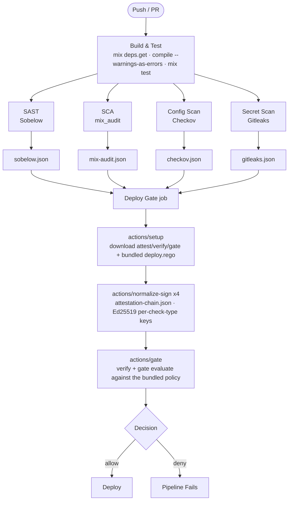
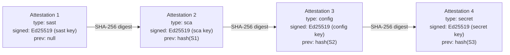

# Phoenix DevSecOps Demo

[](../../actions/workflows/devsecops-pipeline.yml)

A demo [Phoenix](https://www.phoenixframework.org/) application wired into the
[devsecops-attestation](https://github.com/MemerGamer/devsecops-attestation)
cryptographic pipeline.

Every push runs four security checks, then reuses devsecops-attestation's
[composite actions](https://github.com/MemerGamer/devsecops-attestation/tree/main/actions)
to normalize and sign each raw result into an Ed25519-linked attestation
chain, and to evaluate a deploy gate against the project's bundled OPA/Rego
policy. This repository no longer clones or builds the attestation CLI from
source, and no longer carries its own copy of the policy: `actions/setup`
downloads the released binaries and the canonical `deploy.rego`, so there is
exactly one policy to audit, upstream. Deployment only proceeds if every
signature verifies against the authorized per-check-type key and the policy
allows it.

---

## Pipeline overview


```mermaid
flowchart TD
    A([Push / PR]) --> B["Build & Test\nmix deps.get · compile --warnings-as-errors · mix test"]
    B --> C["SAST\nSobelow"]
    B --> D["SCA\nmix_audit"]
    B --> E["Config Scan\nCheckov"]
    B --> F["Secret Scan\nGitleaks"]
    C --> G[sobelow.json]
    D --> H[mix-audit.json]
    E --> I[checkov.json]
    F --> J[gitleaks.json]
    G & H & I & J --> K[Deploy Gate job]
    K --> K1["actions/setup\ndownload attest/verify/gate + bundled deploy.rego"]
    K1 --> L["actions/normalize-sign x4\nattestation-chain.json · Ed25519 per-check-type keys"]
    L --> M["actions/gate\nverify + gate evaluate against the bundled policy"]
    M --> N{Decision}
    N -->|allow| O[Deploy]
    N -->|deny| P[Pipeline Fails]
```

## Attestation chain


```mermaid
flowchart LR
    S1["Attestation 1\ntype: sast\nsigned: Ed25519 (sast key)\nprev: null"] -->|SHA-256 digest| S2
    S2["Attestation 2\ntype: sca\nsigned: Ed25519 (sca key)\nprev: hash(S1)"] -->|SHA-256 digest| S3
    S3["Attestation 3\ntype: config\nsigned: Ed25519 (config key)\nprev: hash(S2)"] -->|SHA-256 digest| S4
    S4["Attestation 4\ntype: secret\nsigned: Ed25519 (secret key)\nprev: hash(S3)"]
```

Each check type uses a dedicated key pair. A compromised SAST key cannot forge
SCA, config, or secret attestations. Any insertion, deletion, or reordering of
attestations breaks the SHA-256 chain linkage and causes `gate evaluate` to
reject the deployment.

## Expected gate outcome

The `deploy-gate` job runs with `expect: deny`, and is expected to deny on
every run. This demo intentionally ships hardcoded `secret_key_base` literals
in `config/dev.exs` and `config/test.exs` (see git history: "fix: block
deployment on any hardcoded credential finding"). Gitleaks findings are
always normalized to `critical` severity, and the bundled `deploy.rego`
policy treats the `secret` check type as zero-tolerance (any finding, any
severity, blocks deployment) as well as blocking any critical finding
outright. So the secret-scan attestation alone is enough to deny the gate,
regardless of what SAST, SCA, or config-scan find. `expect: deny` makes this
the pipeline's intended, non-flaky outcome: the job fails only if the gate
unexpectedly *allows*, or if gate evaluation itself errors (bad signer, hash
mismatch, missing log entry, malformed chain) rather than reaching a policy
decision at all.

If the hardcoded secrets are ever removed from the demo (making it an
"allow" demo instead), flip `expect: deny` to `expect: allow` in
`.github/workflows/devsecops-pipeline.yml`.

---

## Security tools

| Stage | Tool | What it checks |
|---|---|---|
| SAST | [Sobelow](https://github.com/nccgroup/sobelow) | Phoenix-specific vulnerabilities (XSS, SQLi, CSRF...) |
| SCA | [mix_audit](https://github.com/mirego/mix_audit) | Known CVEs in Hex dependencies |
| Config | [Checkov](https://www.checkov.io/) | Misconfigurations in Dockerfile and IaC files |
| Secret | [Gitleaks](https://github.com/gitleaks/gitleaks) | Hardcoded credentials and secrets in source code |

---

## Project structure

```
Phoenix-DevSecOps-Demo/
├── .github/
│   ├── dependabot.yml                # github-actions, mix, docker updates
│   └── workflows/
│       └── devsecops-pipeline.yml   # GitHub Actions CI/CD workflow
├── assets/                          # JS / CSS (esbuild + Tailwind)
├── config/                          # Phoenix config (dev, test, runtime)
├── lib/
│   ├── demo/                        # Application, Repo, Mailer
│   └── demo_web/                    # Router, Endpoint, Controllers, Components
├── priv/repo/migrations/
├── results/
│   └── .gitkeep                     # CI writes scan JSONs here
├── scripts/
│   └── act-debug.sh                 # Local pipeline runner (act)
├── test/
├── Dockerfile
└── mix.exs
```

---

## Setup

### 1. Prerequisites

- Elixir >= 1.15 / Erlang OTP >= 26
- PostgreSQL 14+ running locally (user `postgres`, password `postgres`)
  ```bash
  # Arch / CachyOS
  sudo systemctl start postgresql

  # Docker alternative
  docker run -d --name demo-postgres -p 5432:5432 \
    -e POSTGRES_PASSWORD=postgres postgres:16
  ```

### 2. Install and set up the app

```bash
mix setup   # deps.get + ecto.create + ecto.migrate + assets
```

### 3. Start the server

```bash
mix phx.server
# or inside IEx:
iex -S mix phx.server
```

Visit [http://localhost:4000](http://localhost:4000).

---

## CI/CD setup (GitHub Actions)

The pipeline uses per-check-type key pairs. Each check type has its own dedicated
signing key so a compromise is contained to a single check.

### 1. Generate four key pairs

```bash
git clone https://github.com/MemerGamer/devsecops-attestation
cd devsecops-attestation
for check in sast sca config secret; do
  go run ./cmd/keygen --out "keys/$check"
done
# Each directory contains private.hex (keep secret) and public.hex
```

### 2. Add all eight secrets to this repository

**Settings -> Secrets and variables -> Actions -> New repository secret**

| Secret | Value |
|---|---|
| `SAST_SIGNING_KEY` | Contents of `keys/sast/private.hex` |
| `SCA_SIGNING_KEY` | Contents of `keys/sca/private.hex` |
| `CONFIG_SIGNING_KEY` | Contents of `keys/config/private.hex` |
| `SECRET_SCANNING_SIGNING_KEY` | Contents of `keys/secret/private.hex` |
| `SAST_PUBLIC_KEY` | Contents of `keys/sast/public.hex` |
| `SCA_PUBLIC_KEY` | Contents of `keys/sca/public.hex` |
| `CONFIG_PUBLIC_KEY` | Contents of `keys/config/public.hex` |
| `SECRET_SCANNING_PUBLIC_KEY` | Contents of `keys/secret/public.hex` |

> **Never commit any `private.hex` file.** The `keys/` directory is gitignored in the attestation repo.

### 3. Policy

The `deploy-gate` job's `actions/gate` step passes no `policy` or
`policy-hash` input, so it evaluates against the bundled canonical
`deploy.rego` that `actions/setup` downloads and installs alongside the CLI
binaries (from `policies/deploy.rego` in devsecops-attestation). There is no
local copy of the policy to keep in sync in this repository; the policy
lives and is versioned upstream, one file for every consumer.

### 4. (Optional) Require manual approval before deploy

The `deploy-gate` job targets the `production` environment:

**Settings -> Environments -> production -> Required reviewers**

### 5. Dependabot PRs skip deploy-gate

GitHub withholds repository secrets from workflow runs triggered by
Dependabot, so every `SAST_SIGNING_KEY`-style input on a Dependabot PR would
be empty and the job would abort. The `deploy-gate` job also targets the
`production` environment (see above); if left running, an empty
Dependabot-triggered attempt would sit waiting on required reviewers instead
of failing fast. `deploy-gate` therefore has
`if: github.actor != 'dependabot[bot]'` and simply does not run on Dependabot
PRs. The four scanner jobs (SAST, SCA, config scan, secret scan) are
unaffected and still run and report findings on every PR, including
Dependabot's.

---

## Local development

```bash
# Install deps and set up DB
mix setup

# Run tests
mix test

# Run SAST locally
mix sobelow

# Run SCA locally
mix deps.audit

# Full pre-commit check (compile + format + test)
mix precommit
```

### Local pipeline simulation (act)

```bash
# Runs the full pipeline locally via act. Looks for a devsecops-attestation
# checkout at ../devsecops-attestation by default; override with
# ATTESTATION_SRC=/path/to/devsecops-attestation.
#
# Generates a minimal push.json event payload (gitignored) automatically if
# missing. If .secrets (also gitignored) is missing, the script fails with
# a clear message by default, since that usually means secrets were never
# set up rather than that they are intentionally not needed; set
# ALLOW_NO_SECRETS=1 to opt in, which generates per-check-type test signing
# keys into .secrets automatically.
bash scripts/act-debug.sh

# Run a specific job
bash scripts/act-debug.sh deploy-gate
```

**`deploy-gate` cannot run under act until a devsecops-attestation `v0.4.0`
GitHub release actually exists.** Its `actions/setup` step downloads a
release archive from `MemerGamer/devsecops-attestation`'s GitHub Releases;
with no `v0.4.0` release published, that download 404s. This is not fixable
with act's `--local-repository` flag: that flag only changes where the
*action definition* (`action.yml`) is resolved from, not what
`actions/setup` downloads at runtime (a plain `curl` against
`download-base-url` / the release tag). The only way to exercise
`deploy-gate` locally today is to temporarily edit the workflow so its
`actions/setup` step uses `version: source` instead of `version: 0.4.0`
(see `actions/setup/action.yml` in devsecops-attestation), which builds the
CLI binaries from a local checkout with `go build` instead of downloading a
release archive. That requires Go on the runner's `PATH`, and the workflow
edit should be reverted before committing. Otherwise, use
devsecops-attestation's own `actions/test/run-local.sh` to exercise the
composite actions' scripts directly against a local build. Once `v0.4.0` is
released, the pinned `@v0.4.0` steps will resolve normally under act with no
special handling.

`scripts/act-debug.sh` also prints this warning at runtime when running the
full pipeline or the `deploy-gate` job specifically.

---

## Forgejo

The devsecops-attestation composite actions are plain bash (`shell: bash`),
so they run unmodified on Forgejo Actions runners. On Forgejo, reference them
by full URL instead of the GitHub `owner/repo` shorthand:

```yaml
- uses: https://forgejo.remote.kovacsbalinthunor.com/kbalinthunor/devsecops-attestation/actions/setup@v0.4.0
  with:
    version: 0.4.0
    download-base-url: https://forgejo.remote.kovacsbalinthunor.com/kbalinthunor/devsecops-attestation/releases/download
```

`download-base-url` must be set explicitly on Forgejo: the action's own
default points at the GitHub release. Everything else (signer identity, log
entry URLs, `GITHUB_*`/`RUNNER_*` variables) works unchanged, since Forgejo
Actions exports the same variables the composite actions rely on.

## License

MIT
